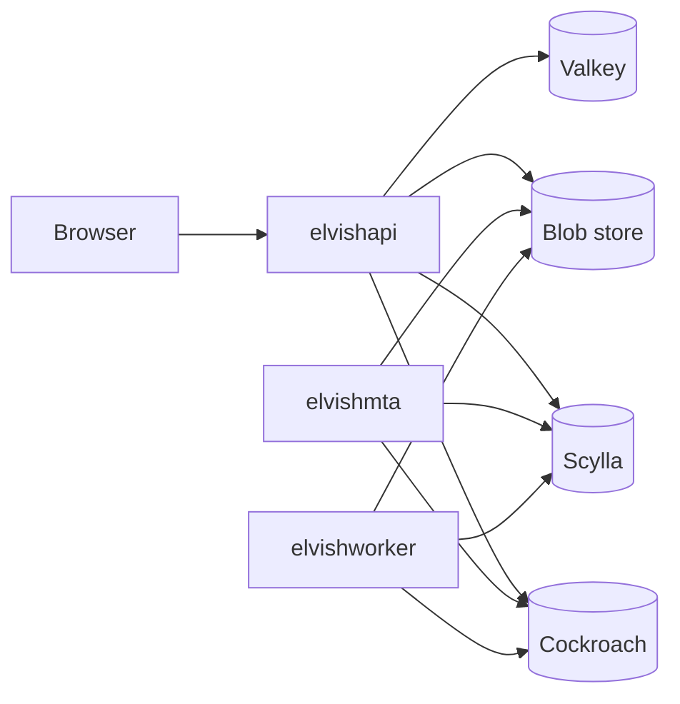

# Architecture

ELVish defaults to **single-origin** HTTP: `elvishapi` serves marketing SSR, mail/auth UI, and `/api/*` on one listen address. Mail transport uses separate Go binaries (`elvishmta`, `elvishworker`). Shared code lives in `libs/go/`. See [CODEBASES.md](../CODEBASES.md).

## Request flow

1. **Browsers** hit **`elvishapi`** for `/`, `/mail`, `/login`, and `/api/*` (same-origin session cookie).
2. **CockroachDB** is the system of record; migrations in `libs/go/db/migrations/` run on **api** startup.
3. **Valkey** holds sessions and rate limits.
4. **ScyllaDB** + **S3-compatible blobs** store mail projections and ciphertext (four-store model, ADR 0007).
5. **SMTP** ingest/delivery uses in-tree `libs/go/smtp` (ADR 0006).
6. **iOS** and **Flutter** clients use the same `/api/` as the browser.

Optional split-origin nginx tiers (`apps/web`, `apps/admin`) are available via compose profile `split-origin`.

