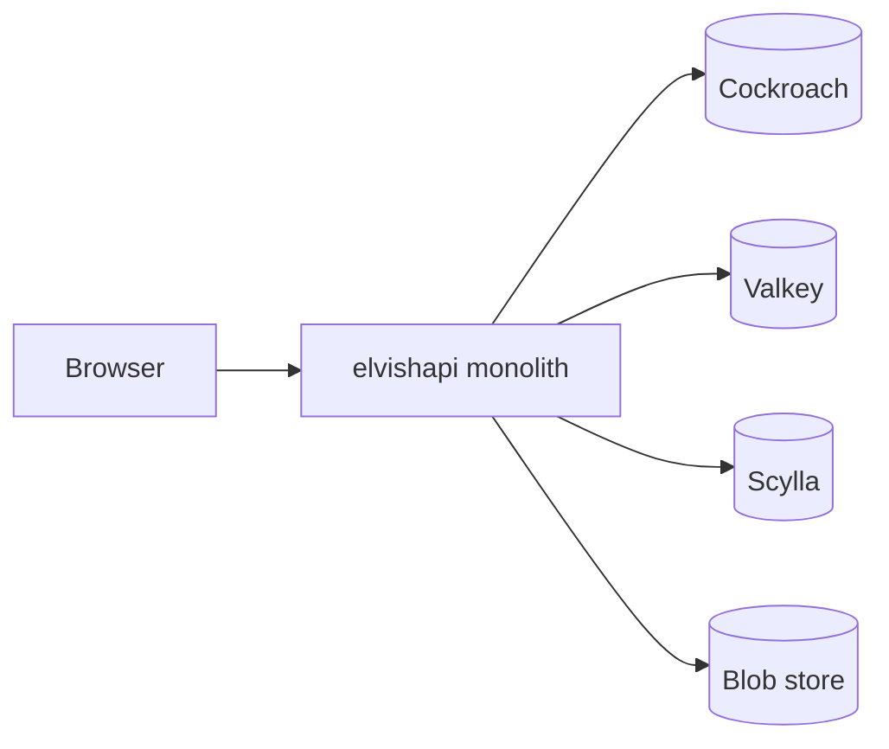

# Architecture

ELVish defaults to a **monolith** `elvishapi` process: marketing SSR, mail/auth UI, `/api/*`, SMTP (MX + submission), outbox delivery, and background sweepers (`ELVISH_MONOLITH=1`). Shared code lives in `libs/go/`. See [CODEBASES.md](../CODEBASES.md).

## Request flow

1. **Browsers** hit **`elvishapi`** for `/`, `/mail`, `/login`, and `/api/*` (same-origin session cookie).
2. **CockroachDB** is the system of record; migrations run on **api** startup.
3. **Valkey** holds sessions and rate limits.
4. **ScyllaDB** + **S3-compatible blobs** store mail projections and ciphertext (four-store model, ADR 0007).
5. **SMTP** ingest and **outbox delivery** run in the same `elvishapi` process when `ELVISH_MONOLITH=1`.
6. **iOS** and **Flutter** clients use the same `/api/` as the browser.

Optional compose profiles: `split-origin` (nginx `web`/`admin`), `split-roles` (`elvishmta` + `elvishworker` with `ELVISH_MONOLITH=0` on api).

