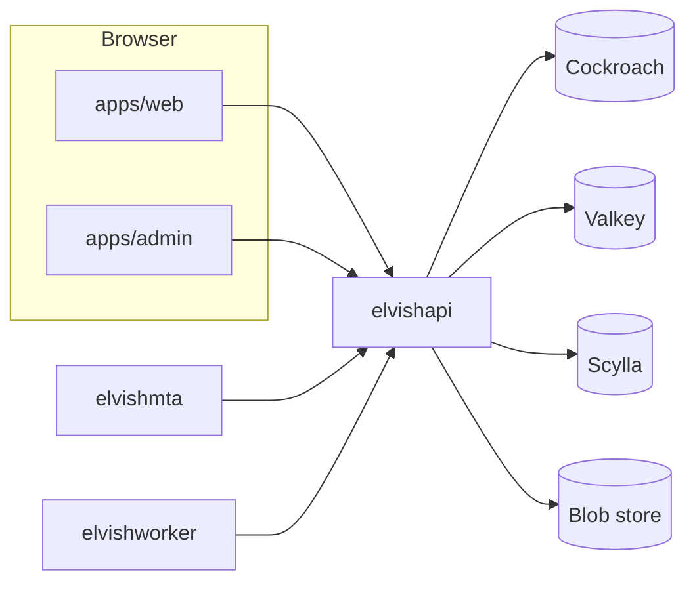

# Architecture

ELVish is a split deploy: **api** (JSON + SSR), **web** (mail/auth static), **admin** (operator), **mta** (SMTP), **worker** (outbox). Shared Go code lives in `libs/go/`. See [CODEBASES.md](../CODEBASES.md) and [ADR 0018](adr/0018-monorepo-split-origin-deploy.md).

## Request flow

1. **Browsers** use `apps/web` for mail (`/mail`, `/login`, …) and `apps/admin` for the operator console. Both call **`elvishapi`** at `/api/*` (session cookie, `ELVISH_COOKIE_DOMAIN` in split deploy).
2. **CockroachDB** is the system of record; migrations in `libs/go/db/migrations/` run on **api** startup.
3. **Valkey** holds sessions and rate limits.
4. **ScyllaDB** + **S3-compatible blobs** store mail projections and ciphertext (four-store model, ADR 0007).
5. **SMTP** ingest/delivery uses in-tree `libs/go/smtp` (ADR 0006).
6. **iOS** and **Flutter** clients use the same `/api/` as the browser.

