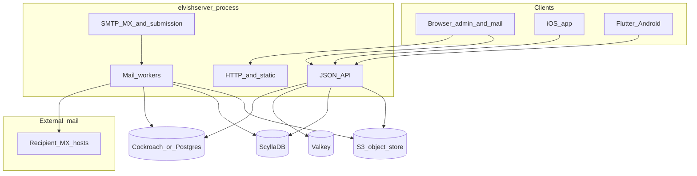

# Architecture overview

**ELVish** ships mainly as a single Go binary, **`elvishserver`**, which serves the public site, JSON API, static assets (including the React admin and browser mail client), and optional in-process SMTP listeners. The Go module path is **`elvish`**. This page is a map; authoritative decisions live in [adr/](adr/) and [e2ee-mail-spec.md](e2ee-mail-spec.md).

## Narrative

1. **Browsers** talk to `elvishserver` over HTTPS (or local HTTP in development). The **admin** and **mail** surfaces are implemented as client-side bundles under `static/` with HTML shells from `templates/`.
2. **CockroachDB** (or any Postgres-compatible server on the same wire protocol) is the **system of record**: users, blog posts, mail settings, outbox rows, identity metadata, and relational invariants. Migrations live in `internal/db/migrations/` and run at startup when `COCKROACH_DSN` is set.
3. **Valkey** (Redis-compatible) holds **ephemeral** data: HTTP sessions, rate-limit counters, and short-lived negative caches used by the mail keyserver path.
4. **Mail at scale** splits hot paths across **ScyllaDB** (mailbox-scale projections and time-ordered access) and **S3-compatible object storage** (ciphertext blobs). See [ADR 0007](adr/0007-four-store-mail-architecture.md). Local development uses Docker Compose for all of these; production sets the same env vars explicitly.
5. **SMTP** receive and submission, outbound delivery, and **DKIM** signing are implemented in-tree (`internal/smtp/`, `internal/dkim/`, workers) per [ADR 0006](adr/0006-own-smtp-stack.md). Listeners are optional and controlled by env (see root README).
6. **Native iOS** uses the same HTTP API; sources live under `IOS/` and read a configurable API base URL (see [IOS/README.md](../IOS/README.md)).
7. **Flutter Android** mail client under `flutter/elvish_mail/` uses the same `/api/...` surface and session cookies (see [flutter/elvish_mail/README.md](../flutter/elvish_mail/README.md)).

## Diagram

Edges are simplified: some read paths hit only SQL; blob and Scylla usage follow the four-store split in ADR 0007. For telemetry rollups only, see [ADR 0011](adr/0011-anonymous-operational-telemetry.md).

## Related reading

- [README.md](../README.md) — runbooks and environment variables
- [CONTRIBUTING.md](../CONTRIBUTING.md) — Make targets and code layout
- [adr/README.md](adr/README.md) — full ADR index
